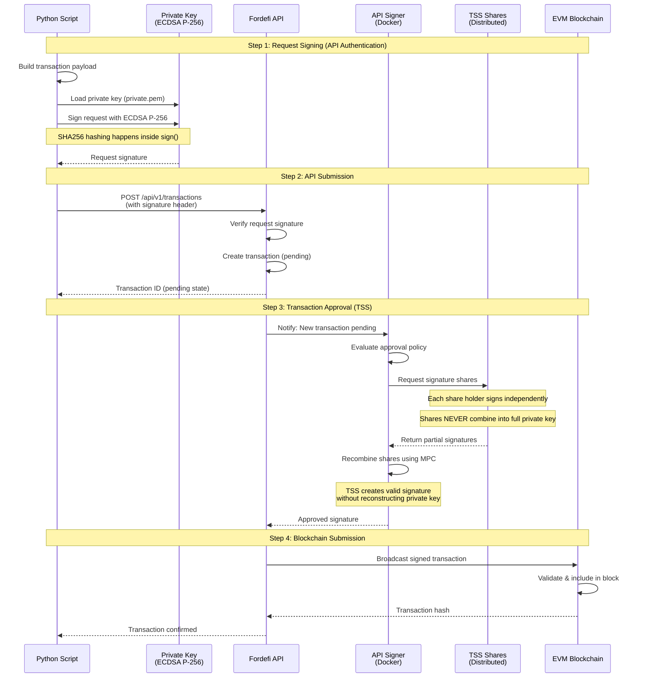
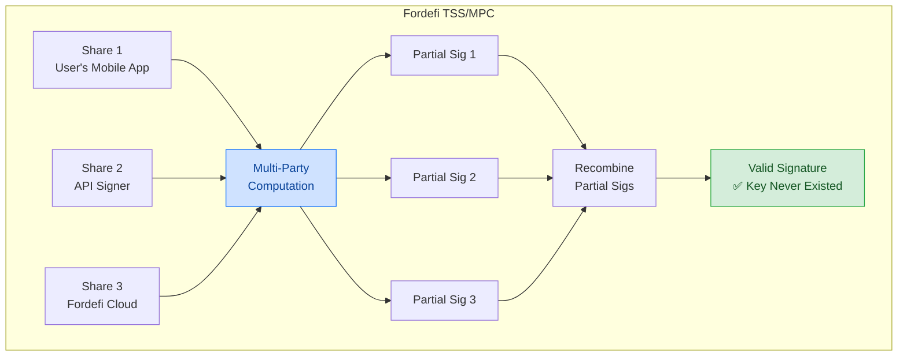

# Fordefi API Integration

Technical assessment for EVM vault operations and token transfers via Fordefi API.

## Table of Contents

- [Project Structure](#project-structure)
- [Tasks](#tasks)
- [Quick Start](#quick-start)
- [Setup](#setup)
- [Usage](#usage)
- [Architecture](#architecture)
- [Implementation Details](#implementation-details)
- [Network Details](#network-details)
- [References](#references)
- [Future Improvements](#future-improvements)

## Project Structure

```
fordefi/
├── src/                   # Source code
│   ├── config.py          # Configuration and environment management
│   ├── create_vault.py    # Creates EVM vaults (work across all chains)
│   ├── send_token.py      # ERC20 token transfers via evm_transfer
│   └── wrap_eth.py        # ETH wrapping via evm_raw_transaction
├── .env.example           # Environment variables template
├── .env                   # Your actual config (create from .env.example)
├── .gitignore             # Protects secrets from Git
├── private.pem            # ECDSA P-256 private key (generate, never commit)
├── public_key.pem         # ECDSA P-256 public key (generate, never commit)
├── requirements.txt       # Python dependencies
└── README.md              # This file
```

**Key Files:**
- **`src/config.py`** - Centralized configuration. Loads environment variables, validates setup, defines network constants (chain IDs, contract addresses)
- **`src/create_vault.py`** - Vault creation. EVM vaults have a single address that works across all EVM-compatible chains
- **`src/send_token.py`** - Token transfers. Implements `evm_transfer` transaction type with ECDSA P-256 request signing
- **`src/wrap_eth.py`** - Smart contract interaction. Wraps ETH to WETH using `evm_raw_transaction` with function selector encoding

## Tasks

1. ✅ Create EVM vault and transfer 1 USDC on Unichain
2. ✅ Create EVM vault on Ethereum Sepolia and wrap ETH to WETH

## Completed

**Task 1 - Unichain USDC Transfer:**
- Transaction: `0x9b02cb6f7e9f446fcb737d3dc827e5f76ec396fdb73012f043177aafd00592ef`
- Explorer: https://unichain.blockscout.com/tx/0x9b02cb6f7e9f446fcb737d3dc827e5f76ec396fdb73012f043177aafd00592ef
- Amount: 1 USDC to `0x8BFCF9e2764BC84DE4BBd0a0f5AAF19F47027A73`

**Task 2 - Sepolia ETH Wrapping:**
- Vault ID: `646c57e4-bbb4-434f-855f-e0141a88265d`
- Vault Address: `0xAcb22Ab21310bE639B4612219d87A64821A48Ec8`
- Transaction Hash: `0x66549c7c08169888b2a70108d393c2f85bf3a7f2de3dbc585e4f5e78f1567e12`
- Explorer: https://sepolia.etherscan.io/tx/0x66549c7c08169888b2a70108d393c2f85bf3a7f2de3dbc585e4f5e78f1567e12
- Amount: 0.1 ETH wrapped to WETH
- WETH Contract: `0xfFf9976782d46CC05630D1f6eBAb18b2324d6B14`
- Status: ✅ Confirmed (deposit() function called successfully)

## Quick Start

```bash
# 1. Install dependencies
python3 -m venv venv && source venv/bin/activate && pip install -r requirements.txt

# 2. Generate keys
openssl ecparam -genkey -name prime256v1 -noout -out private.pem
openssl ec -in private.pem -pubout -out public_key.pem

# 3. Configure
cp .env.example .env
# Edit .env with your Fordefi API credentials

# 4. Run API Signer (in separate terminal)
docker run --rm --log-driver local \
  --mount source=fordefi-vol,destination=/storage \
  -it fordefi.jfrog.io/fordefi/api-signer:latest

# 5. Create vault and transact
python3 src/create_vault.py "My Vault"
python3 src/send_token.py <vault_id> <recipient> <amount> <token> <chain_id>
python3 src/wrap_eth.py <vault_id> <amount_wei>
```

## Architecture

### Transaction Flow

The complete flow from Python script to blockchain confirmation:



### TSS/MPC Security Model

Fordefi uses Threshold Signature Scheme (TSS) with Multi-Party Computation (MPC) to sign transactions without ever reconstructing the full private key:



**Key Security Features:**
- Vault private key is distributed as TSS shares
- Each share holder computes partial signatures independently
- Partial signatures combine into valid blockchain signature
- Full private key **never exists in memory** at any point
- Compromising one share doesn't grant access (with threshold ≥ 2)

## Setup

### 1. Install Dependencies

```bash
python3 -m venv venv
source venv/bin/activate
pip install -r requirements.txt
```

### 2. Generate ECDSA P-256 Keypair

```bash
openssl ecparam -genkey -name prime256v1 -noout -out private.pem
openssl ec -in private.pem -pubout -out public_key.pem
```

### 3. Configure Environment

Copy `.env.example` to `.env` and fill in your credentials:

```bash
cp .env.example .env
```

Edit `.env` with your actual values:
```env
# Get these from Fordefi console: Settings → API Users → Create API User
FORDEFI_ACCESS_TOKEN=your_actual_access_token
FORDEFI_ORG_ID=your_actual_org_id
FORDEFI_PRIVATE_KEY_PATH=./private.pem
```

**⚠️ Never commit `.env` or `*.pem` files to Git - they contain secrets**

### 4. Run API Signer

Transactions require the API Signer (Docker) to be running:

```bash
docker login -u fordefi fordefi.jfrog.io
docker pull fordefi.jfrog.io/fordefi/api-signer:latest
docker run --rm --log-driver local \
  --mount source=fordefi-vol,destination=/storage \
  -it fordefi.jfrog.io/fordefi/api-signer:latest
```

Register public key via API Signer menu for your API user.

## Usage

### Create Vault

```bash
# Create EVM vault (default - works across all EVM chains)
python3 src/create_vault.py "Vault Name"
```

**Vault Types:**
- `evm` (default): Works across all EVM chains (Ethereum, Polygon, Unichain, etc.)
- `bitcoin`, `solana`: Other blockchain types (see Fordefi API docs)
- This assessment focuses on EVM vaults

**To specify vault type explicitly:**
```python
from src.create_vault import create_vault
create_vault('My Vault', vault_type='evm')
```

### Send Tokens

```bash
python3 src/send_token.py <vault_id> <recipient> <amount> <token_address> [chain_id]
```

### Wrap ETH to WETH

```bash
python3 src/wrap_eth.py <vault_id> <amount_wei> [weth_address] [chain_id]
```

Example (Task 1 - USDC Transfer):
```bash
python3 src/send_token.py \
  17332797-9d4e-4a97-8977-502863b7bc8c \
  0x8BFCF9e2764BC84DE4BBd0a0f5AAF19F47027A73 \
  1000000 \
  0x078D782b760474a361dDA0AF3839290b0EF57AD6 \
  130
```

Example (Task 2 - Wrap ETH):
```bash
python3 src/wrap_eth.py \
  646c57e4-bbb4-434f-855f-e0141a88265d \
  100000000000000000
```

## Implementation Details

### API Request Signing

Fordefi requires ECDSA P-256 signatures for all transaction requests.

**Message format:** `path|timestamp|body`  
**Signature:** Base64-encoded DER format

```python
def sign_request(path, body, timestamp, private_key):
    message = f"{path}|{timestamp}|{body}"
    signature = private_key.sign(message.encode('utf-8'), ec.ECDSA(hashes.SHA256()))
    return base64.b64encode(signature).decode('utf-8')
```

**Critical:** `ec.ECDSA(hashes.SHA256())` hashes internally. Do not pre-hash the message.

### Transaction Types

**`evm_transfer` (ERC20 tokens):**
```json
{
  "vault_id": "uuid",
  "signer_type": "api_signer",
  "type": "evm_transaction",
  "details": {
    "type": "evm_transfer",
    "to": "recipient",
    "value": {"type": "value", "value": "amount"},
    "asset_identifier": {
      "type": "evm",
      "details": {
        "type": "erc20",
        "token": {
          "chain": "evm_<chain_id>",
          "chain_id": "<chain_id>",
          "hex_repr": "token_address"
        }
      }
    }
  }
}
```

**`evm_raw_transaction` (Contract calls):**
```json
{
  "vault_id": "uuid",
  "signer_type": "api_signer",
  "type": "evm_transaction",
  "details": {
    "type": "evm_raw_transaction",
    "to": "contract",
    "value": "amount",
    "data": {"type": "hex", "hex_data": "0x..."},
    "chain": "evm_<chain_id>"
  }
}
```

**Key differences:**
- `evm_transfer`: `value` is object, uses `asset_identifier`, requires `chain_id`
- `evm_raw_transaction`: `value` is string, uses `data` object, requires `chain`

## Network Details

- **Unichain Sepolia:** Chain ID `130` | USDC: `0x078D782b760474a361dDA0AF3839290b0EF57AD6`
- **Ethereum Sepolia:** Chain ID `11155111` | WETH: `0xfFf9976782d46CC05630D1f6eBAb18b2324d6B14`

## References

- [Fordefi API Documentation](https://docs.fordefi.com/)
- [API Reference](https://docs.fordefi.com/reference/getting-started)

## Future Improvements

### Interactive CLI
Create a unified interactive CLI for better user experience:

```python
# Proposed: fordefi_cli.py
python3 src/fordefi_cli.py

> Select action:
  1. Create vault
  2. Send tokens
  3. Wrap ETH to WETH
  4. View vault balances
  5. Exit

> Select vault:
  [List available vaults with names and addresses]

> Select asset:
  [List available assets in vault]

> Enter amount:
  [Interactive input with validation]
```

**Benefits:**
- No need to remember command arguments
- Interactive vault and asset selection
- Input validation and error handling
- Better user experience for non-technical users

### Additional Features
- **Vault Management:** List, rename, archive vaults
- **Balance Checking:** Query vault balances across chains
- **Transaction History:** View past transactions with filtering
- **Batch Operations:** Process multiple transactions at once
- **Config Wizard:** Interactive setup for first-time users
- **Error Recovery:** Automatic retry for failed transactions
- **Gas Estimation:** Preview transaction costs before sending
